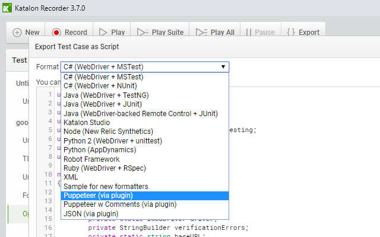

### Plugin for Katalon Recorder
A chrome extension that allows recording your actions then exporting/replaying them as puppeteer code.

If you're looking for a way of easily creating UI tests this is what you have been looking for.

You can download the plugin from the [chrome extension web store](https://chrome.google.com/webstore/detail/puppeteer-exporter-for-ka/idgpmhfldhpaoiflfleanildmnojchhd)

### Fixing common issues:
1. `Error: Execution context was destroyed, most likely because of a navigation.`
    * You likely need to add `await page.waitfornavigation();` after your `page.click()` etc...

### Supported Katalon Commands:
* `open` &rarr; `page.goto`
* `doubleclick` &rarr; `element.click({ clickCount: 2 });`
* `click` &rarr; `element.click();`
* `store` &rarr; `let variable = value;`
* `type` &rarr; `element.type();`
* `pause` &rarr; `page.waitFor();`
* `mouseover` &rarr; `page.hover();`
* `deleteallvisiblecookies` &rarr; `page.deleteCookie(await page.cookies());`
* `capturescreenshot` &rarr; `page.screenshot({ path: 'name.png' });`
* `captureentirepagescreenshot` &rarr; `page.screenshot({ path: 'name.png', fullPage: true });`
* `bringbrowsertoforeground` &rarr; `page.bringToFront();`
* `refresh` &rarr; `page.reload();`
* `echo` &rarr; `console.log();`
* `get` &rarr; `page.goto();`
* `comment` &rarr; `// comment`
* `submit` &rarr; `page.evaluate(form => form.submit(), formElement);`
* `sendkeys` &rarr; `page.keyboard.press();`
* `selectframe` &rarr; `frames.find(f => f.name() === 'targetName');`
* `selectwindow`
* `assertelementpresent`
* `verifyelementpresent`
* `waitforpagetoload`
* `waitforvisible` &rarr; `page.waitForXPath('target', { visible: true });`